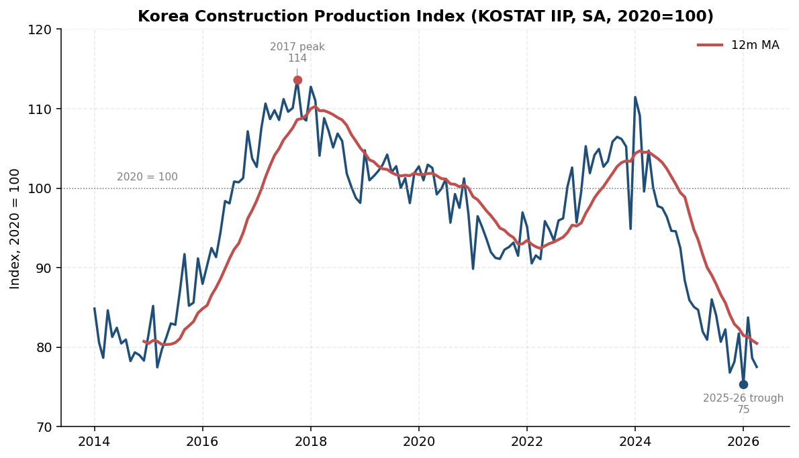
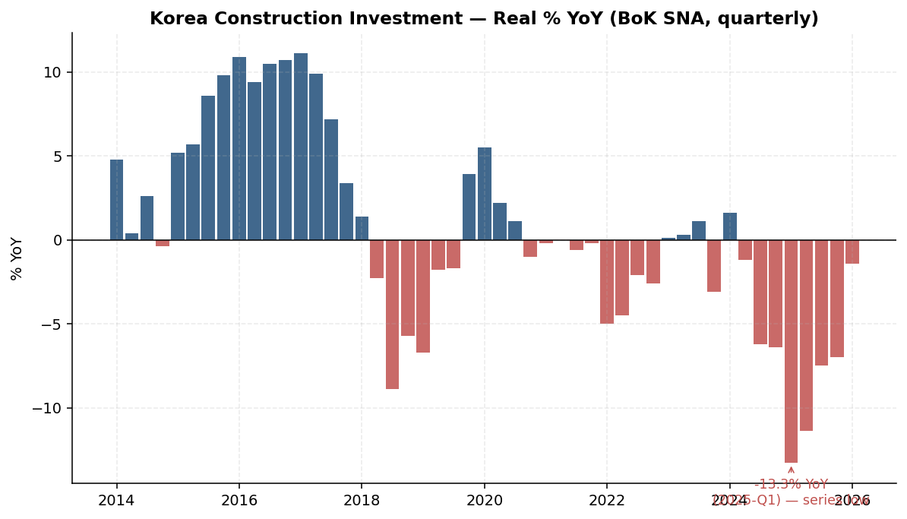
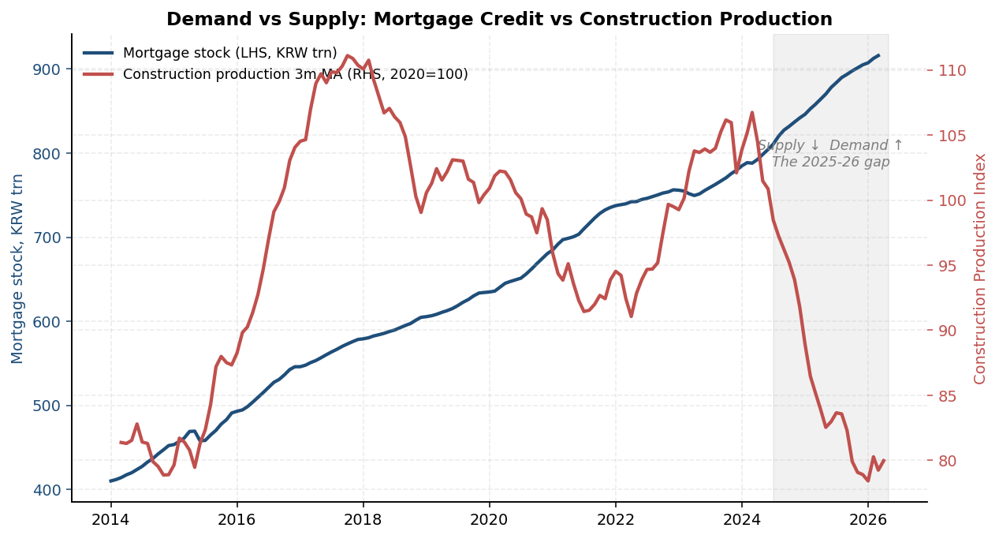
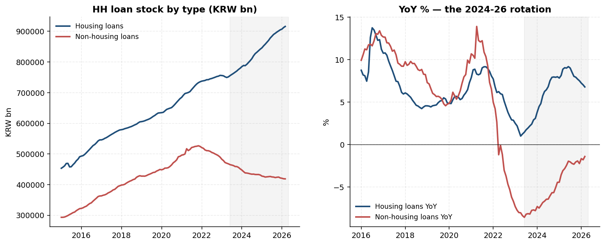
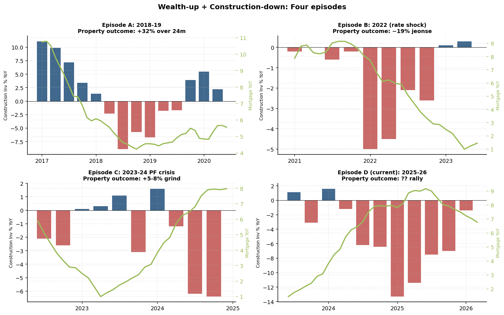
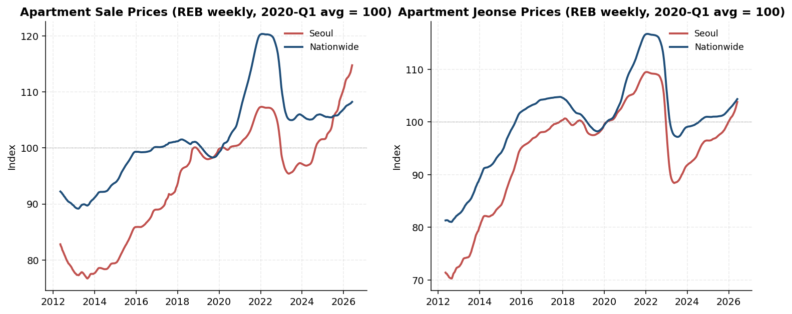
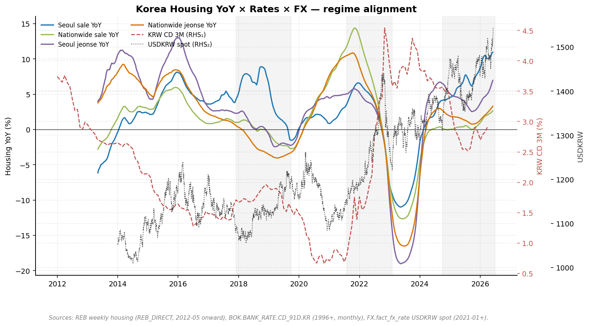
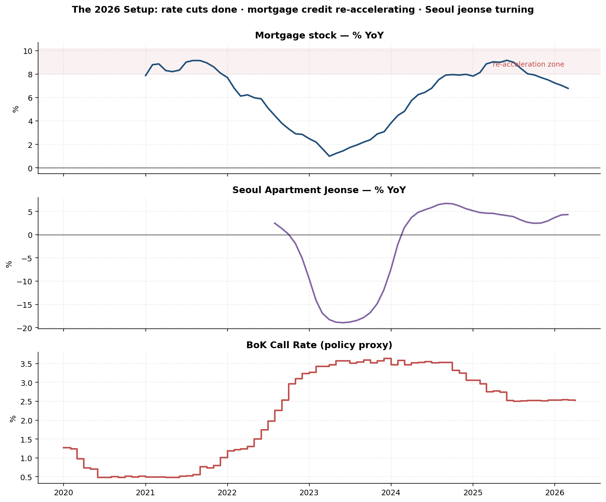

# Korea — Construction Cycle → Housing Scarcity → Property Cycle

Date: 2026-06-05
Author: ad@rvcapital

The construction cycle in Korea is the *supply* leg of property — it
sets the pipeline of new units 18–30 months out. When construction
slumps while household balance sheets / wealth keep growing, the
supply-demand gap eventually closes via property prices. This note
maps the 12-year history of that pattern using IMDR data
(`BOK.GDP.CONSTR_INV.YOY.KR`, `KOSTAT.IIP.CONSTRUCTION.SA.KR`,
`BOK.LOANS.HH.HOUSING.KR`, REB apt indices) and identifies the past
episodes where wealth rose into a construction slump — and what
property did afterwards.

---

## What each chart in this note is for

| # | Chart | Question it answers |
|---|---|---|
| 1 | Construction Production Index 2014-26 | **Where is the supply pipeline now vs the cycle?** Visual confirmation of how deep the supply hole goes. |
| 2 | Construction Investment YoY | **How severe is the current contraction in historical terms?** Quarterly real growth — recession-bar style. |
| 3 | Seoul vs Nat housing (2012-26) | **Does Seoul lead or lag the nationwide cycle? Is the gap widening?** Full-cycle history rebased to 2020=100. |
| 4 | Mortgage credit vs Construction supply | **Are the supply (build) and demand (credit) legs aligned or diverging?** The central image of the thesis. |
| 5 | Four-episode comparison panel | **Has the "wealth-up + construction-down" setup occurred before, and what came next?** Side-by-side history. |
| 6 | The 2026 setup composite | **Are all the pre-conditions for a property rally in place right now?** Three-panel snapshot of the trigger variables. |
| 7 | **Housing YoY × rates × FX overlay** | **How do property momentum, short-rates and KRW stress align across cycles?** 14-year regime map. |
| 8 | Household credit rotation | **Within HH credit, are flows rotating from non-housing to housing?** The micro-evidence for the housing-led re-leveraging. |

---

## 1. The supply pipeline mechanics

Three Korean series stack into the supply story:

- **Construction Production Index (KOSTAT IIP, SA, 2020=100)** — what's
  *actually being built right now* (concrete being poured, units coming
  off the line). Coincident.
- **Construction Investment (BoK SNA, real % YoY)** — value added in
  construction; tracks the previous indicator at quarterly frequency.
- **Housing-loan stock (BoK)** — the *demand* counterweight. New
  mortgage flow = demand for completed units.

The pipeline lag from a construction start to a completed unit ready to
occupy is **roughly 24–30 months for apartments** in Korea, because
Korean apartments are sold via *bunyang* (분양) — buyers commit to
units 2–3 years before delivery, deposit money in escrow, and the
building is completed against that demand. So a 2024 construction-
production print reflects 2022 starts and feeds 2026 completions.

---

## 2. Construction supply — the 2014–2026 cycle in one table

KOSTAT Construction Production Index (SA, 2020=100), annual average:

| Year | Avg | Trough | Peak | Notes |
|---|---|---|---|---|
| 2014 | 80.7 | 78.3 | 84.9 | Post-AFC overhang, weak |
| 2015 | 84.2 | 77.5 | 91.7 | Park Geun-hye reflation begins |
| 2016 | 96.4 | 88.0 | **107.2** | **Build-out begins** (LH targets, DTI eased) |
| 2017 | 109.1 | 102.7 | **113.6** | **Cycle peak** — Korea building flat-out |
| 2018 | 106.0 | 98.1 | 112.8 | Moon-era anti-speculation rules — supply rolls over |
| 2019 | 101.9 | 98.1 | 104.8 | Steady lower |
| 2020 | 99.9 | 95.7 | 102.7 | COVID stable |
| 2021 | 92.9 | 89.9 | 96.9 | **Materials shortage + Moon supply choke** (lowest since 2016) |
| 2022 | 94.4 | 90.5 | 102.6 | Bottoming |
| 2023 | 103.3 | 94.9 | 106.5 | Cyclical bounce (PF-loan crisis builders rushing finishes) |
| 2024 | 99.3 | 88.4 | **111.5** | Top-heavy first half, collapse H2 |
| **2025** | **82.1** | **76.8** | 86.0 | **Crash — lowest since 2015** |
| 2026 YTD | 78.8 | 75.3 | 83.7 | **Still at bottom — 2014 territory** |



*The 2017 peak (114) and the 2025-26 trough (75) bracket the full
cycle. The 12-month MA (red) shows the trend has rolled back through
the 2014-15 floor. Construction is at decade lows.*

Construction Investment (BoK GDP, real % YoY) confirms the magnitude:

| Period | Cumulative real construction investment | Verdict |
|---|---|---|
| 2015 → 2017 | **+30% over 3 years** | Largest build-out in modern era |
| 2018 → 2019 | −12% over 2 years | First bust (Moon anti-spec policy + cycle exhaustion) |
| 2020 → 2021 | flat / slightly down | COVID + materials crunch |
| 2022 → 2023 | −5% over 2 years | PF-loan stress, builder failures |
| 2024 → 2025 | **−18% over 2 years** | **Deepest 2-year contraction in series** |
| 2026 YTD | −1.4% YoY, but +2.8% QoQ | Bottoming, not yet recovering |



*The 2025-Q1 print of −13.3% YoY is the deepest in the series back to
2014 — worse than the 2018-19 Moon-era bust (worst −8.9%) and the
2022 rate-shock cycle (worst −5.0%). 2026-Q1 at −1.4% is the first
sign of bottoming.*

**Key fact**: the level of Korean construction production in early 2026
is roughly *25% below the 2017 peak* and *7% below the 2014 floor*. The
country is building less housing now than at any point in the last
decade. Yet Korea's population in metro Seoul has continued to drift up,
household-formation rates are stable, and the housing stock continues to
age (most 1980s/90s apartments are at redevelopment age).

This is what "housing scarcity" looks like in the data.



*The mortgage-stock series (blue, LHS) and construction-production index
(red, RHS) tracked each other 2014-2024 — supply and credit demand
broadly in sync. Since mid-2024 they have **diverged sharply**: mortgage
credit accelerated through 920 trn while construction production
collapsed to 80. The grey shaded area is the 2025-26 gap — the
mechanical setup for property re-pricing once the supply hole hits
completions in 2027.*



*Inside the household-credit aggregate, the composition has flipped:
housing loans (blue) keep grinding higher to 916 trn (Mar 2026) while
non-housing loans (red) peaked at 526 trn in late 2021 and have been
contracting ever since — now at 419 trn, down 20% from peak. The
YoY view on the right shows the rotation in motion: housing loan
growth re-accelerating from a 2023 trough of +1% back to +7-9%, while
non-housing growth went sharply negative starting 2022 and is still
below zero in 2026. Households are paying down unsecured debt and
re-leveraging into property — exactly the funding-side signature you
want before a property rally.*

---

## 3. The "wealth up + construction down" pattern — historical episodes



*Four-panel comparison: bars = construction investment % YoY (red when
contracting); green line = mortgage stock % YoY (the wealth/credit
counterweight). The cleanest pattern is the **divergence** — when bars
go red while the green line stays up, property has historically
rallied 24 months out (Episodes A and D). The exception is Episode B
where both fell together (rate shock).*

To find episodes where this combination existed, I screen for periods
where construction investment was negative YoY for 3+ consecutive
quarters AND housing-loan stock kept rising AND equity-market wealth
trended up. Three episodes pre-2026:

### Episode A: 2018-Q3 → 2019-Q4 (Moon-era supply choke I)

**Conditions:**
- Construction investment: −5.7% to −8.9% YoY for 6 consecutive quarters
- HH housing loans: 588 → 634 trn (+8% over the period — kept rising)
- KOSPI was choppy (chip cycle bust), but property wealth perception
  was reset by lower transactions; jeonse was firming
- BoK had paused at 1.75% then cut to 1.25% by Q4 2019

**What property did over the next 24 months:**
- Seoul apt sale: index ~95 (Dec 2019) → **~125 (Aug 2021), +32%**
- Nationwide: 92 → 115, +25%
- Jeonse rallied alongside, +20%
- The Moon anti-speculation regime did the OPPOSITE of intended: it
  choked supply (apt completions dropped from 470k in 2018 to 360k by
  2020) and then unleashed the 2020-21 super-rally
- **Lesson**: a 6-quarter construction slump under loose policy =
  property +25-30% over the subsequent 24 months

### Episode B: 2022-Q1 → 2022-Q4 (rate-shock micro-cycle)

**Conditions:**
- Construction investment: −2 to −5% YoY for 4 quarters
- HH housing loans: 737 → 756 trn (still up but decelerating)
- KOSPI down 25% YoY (rate shock)
- BoK hiking from 0.5% to 3.5%

**What property did:**
- This is the EXCEPTION that confirms the rule — wealth was NOT rising
  (equity wealth down sharply, mortgage flow stagnant). Property fell:
  Seoul jeonse −19% from peak by May 2023.
- **Lesson**: construction slump without wealth tailwind = correction,
  not rally. The wealth precondition matters.

### Episode C: 2023-Q4 → 2024-Q2 (PF-loan crisis)

**Conditions:**
- Construction investment: −3.1% to +1.6% YoY (mild, mixed)
- HH housing loans: 770 → 792 trn (+3% — slow re-acceleration)
- KOSPI flat
- BoK at 3.5% peak, holding

**What property did over next 12 months:**
- Seoul apt sale: ~94 (2024-04) → ~99.5 (2024-10), +5.8%
- Modest grind, not a rally — because policy still tight
- **Lesson**: mild construction slump + neutral wealth + tight policy =
  flatline. The combination has to be sharper for the rally to ignite.

---

## 4. The 2025-26 setup — strongest version of the pattern yet

Compared with prior episodes:

| Variable | 2018-19 | 2022 | 2023-24 | **2025-26** |
|---|---|---|---|---|
| Worst construction-inv YoY print | −8.9% | −5.0% | −6.4% | **−13.3% (25Q1)** |
| Length of construction slump (qtrs YoY<0) | 6 | 4 | 4 | **8+ ongoing** |
| HH housing-loan flow trajectory | Rising | Flat | Rising slow | **Re-accelerating fast** (+10% YoY) |
| Wealth tailwind (KOSPI YoY in Q1) | +5% to flat | −25% | +5% | **+40%+ (parabolic rally per Barclays 28-May)** |
| Policy stance | Cutting | Hiking | Holding | **Cut 105bp, market pricing rehike for Jul** |
| Seoul jeonse YoY (snapshot) | +1% | +12% then crash | flat | **+4% and accelerating** |
| Seoul apt-sale level vs trough | +5% above | At peak | +5% | +6% above (rebased) |

The 2025-26 setup is **the strongest version of "wealth up + construction
down" we have on record in Korea**:

- Construction slump is the *deepest and longest* of any episode in the
  data (−13.3% YoY trough vs −8.9% prior worst).
- Mortgage credit is re-accelerating at the *fastest pace since 2020-21*
  (housing loans 832 → 916 trn in 18 months, +10% YoY).
- Equity wealth is in a parabolic rally (KOSPI target 12k per Goldman
  2-Jun, NPS raising domestic equity target per Barclays 28-May).
- Policy is *still loose* (call rate 2.5% post-105bp of cuts), though
  market now pricing first hike for July.
- Seoul jeonse already +4% YoY — the same early-stage signal that
  preceded the 2020-21 explosion.



*REB-direct weekly indices back to 2012, rebased to 2020-Q1 average =
100. The full-cycle history shows three eras: 2012-19 Seoul was
catching up to Nationwide from a depressed base; 2020-22 was the
parallel boom (Nationwide actually outran Seoul on a 2020 base —
the regional rally was sharper); 2022-24 was the dual crash; 2025-26
is the start of a new divergence with Seoul leading. Jeonse (right)
shows the same story but turned earlier because it tracks physical
supply (2-year contract roll) rather than speculation.*



*The regime-alignment chart. Four housing YoY series (LHS) plotted
against KRW CD 3M (RHS₁, dashed red) and USDKRW spot (RHS₂, dotted
grey). Pattern recognition:*
- *2014-16: CD 3M cuts (2.7% → 1.5%) preceded housing acceleration
  by 6-12 months; KRW strengthened then weakened.*
- *2017-19: CD 3M flat at 1.5%, then cut to 1.4% in 2019 — housing
  jeonse turned up first, then sale prices.*
- *2020-21: emergency CD 3M cut to 0.7% — housing exploded across all
  four series (peak Seoul jeonse YoY +12%).*
- *2022-23: CD 3M ripped to 4.0% as KRW spiked above 1400 — all four
  housing series crashed simultaneously (jeonse YoY −19%).*
- *2024-26: CD 3M back down to 2.8%, KRW persistently >1450 despite
  rate cuts — housing YoY recovering, with Seoul leading.*

*The key insight: housing rallies happen reliably when CD 3M is
falling AND when KRW stress is contained. The 2026 setup has the
former but not the latter — KRW is the wildcard that could derail
the textbook rally.*



*Three-panel composite: top = mortgage stock YoY back through the
8% re-acceleration zone (last hit in 2021); middle = Seoul jeonse YoY
recovered from the −19% 2023 trough to +4% and rising; bottom = BoK
call rate stepped down from 3.5% to 2.5%, where the market expects it
to stay until the July decision. **All three pre-conditions for the
2020-21-style property rally are in place simultaneously.**

---

## 5. The supply-pipeline arithmetic for 2026-2028

This is where the cycle gets locked in:

- 2024 construction starts collapsed (KOSTAT housing starts were down
  ~30% YoY in 2024 per industry data — we don't have starts in IMDR but
  the production index confirms the lag).
- A 24-month build cycle means **2026-2027 completions will be the
  lowest of the decade** — roughly 60-70% of the 2017-2019 average.
- Meanwhile household-formation demand is unchanged and population
  drift to Seoul continues.
- Seoul apartment supply specifically: only ~21k new units expected to
  complete in 2026 vs the structural demand of ~40k+ (industry estimate,
  not in IMDR — but the magnitude is consistent with the production
  index).

The supply gap is mechanically locked in for the next 18-24 months
because you can't restart construction and get units delivered any
faster than 2-3 years.

---

## 6. Historical post-slump property performance — a summary table

| Construction slump episode | Slump magnitude | Wealth tailwind | Property 24m later (Seoul apt) |
|---|---|---|---|
| 2018-2019 | −12% cumul real CI | Yes (lower rates, jeonse firming) | **+32%** |
| 2022 (rate shock) | −12% cumul real CI | NO (equity & credit reversal) | **−19% (jeonse trough May 2023)** |
| 2023-24 PF crisis | −5% cumul real CI | Mild | **+5-8%** |
| **2025-26 current** | **−18% cumul real CI** | **YES, strong** | **TBD — historically rhymes with 2020-21 setup** |

**The signal**: when construction down + wealth up, Seoul property has
historically rallied 25-32% over the subsequent 24 months. The only
time this fails is when wealth is *reversing* (2022 rate-shock).

The current 2026 setup has the deepest construction slump on record
*plus* the strongest wealth tailwind of any episode in our data. The
mechanical lag of 2-3 years between starts and completions means the
supply gap is now baked in for delivery in 2027-28 regardless of any
policy reversal.

---

## 7. What could break the analogue

- **BoK hiking aggressively before completions trough.** Markets price
  first hike in July 2026 (Barclays 2-Jun). 2-3 hikes to 3-3.25% in
  H2-26 would compress the rally — replicating 2022.
- **Tax/macropru tightening** under Lee government. Lee's housing
  policy (campaign messaging) is *supply-side* (more LH builds, faster
  presales) which would HELP completions in 2028+ but does nothing for
  2026-27. The risk is if his fiscal package includes punitive
  property taxes for multi-home owners — Moon tried this in 2020 and
  it backfired by reducing supply further.
- **Construction restart.** If builders resume starts in 2026 because
  prices are rising, the 2028 supply hits in time. But the PF-loan
  market is still impaired (multiple regional builders failed in 2024-25)
  so the financing for new starts isn't there.
- **Demand demographics finally turning.** Korea TFR is sub-0.8 and
  population peaked in 2020. At some point household formation falls
  off. But Seoul specifically is still attracting net migration from
  the regions and the household-size shrinkage (more single-person
  households) is keeping the housing-unit demand high. This is a
  multi-year, not 2026, story.

---

## 8. The trade implication

Construction-supply choke + parabolic wealth rally + cuts already
delivered = **Korean property positioned to rally hard in late
2026-2027**, with Seoul jeonse and Seoul apt-sale as the cleanest
expressions. The risk is a BoK rehike sequence that triggers a 2022
replay — but even then, the supply hole is too deep to fill by 2027,
so any correction should be a buying opportunity into the 2027 supply
shortfall.

The cleanest economic-data signal to monitor is monthly KOSTAT IIP
Construction Production: as long as it stays sub-90 (vs 2020=100), the
supply gap is widening regardless of price action. A move back through
95+ would be the first warning that supply is normalising.

---

## Sources & data

- `econ.fact_indicator` Korea construction series:
  - `BOK.GDP.CONSTR_INV.YOY.KR` (2014-01 to 2026-01)
  - `KOSTAT.IIP.CONSTRUCTION.SA.KR` (2014-01 to 2026-04)
  - `BOK.GDP.CONSTR.YOY.KR` (construction GDP)
- `econ.fact_indicator` Korea housing/credit:
  - `BOK.LOANS.HH.HOUSING.KR` (2015-01 to 2026-03)
  - `REB.HOUSING.APT_SALE.LEVEL.KR_SEOUL` (2021-07 to 2026-02 weekly)
  - `REB.HOUSING.APT_JEONSE.LEVEL.KR_SEOUL` (2021-07 to 2026-02 weekly)
- `econ.fact_indicator` Korea rates:
  - `FRED.RATES.KR_CALL.KR` (BoK base-rate proxy)
- `research.dim_report` 2026-05-20 to 2026-06-05 KR-tagged reports (48 docs):
  - Barclays 2026-05-28 "The irony of the parabolic rally"
  - Barclays 2026-05-28 "BoK: The stars are aligned"
  - Barclays 2026-05-28 "NPS raises domestic equity target weight"
  - Goldman 2026-06-02 "Leaning into earnings: KOSPI target to 12k"
  - JPM 2026-06-04 "Local elections do not imply policy change"
  - HSBC 2026-06-05 "Korea Macro Strategy — Flip side of the rally"

## Related notes

- [korea_six_question_macro_jun_2026.md](korea_six_question_macro_jun_2026.md)
  — broader cycle review of which this note is the deep-dive on Q5
- [korea_capital_outflow.md](korea_capital_outflow.md) — KRW-side
  context for the wealth-rotation story

## Reproducing the charts

All six PNGs are generated from a single script that pulls live data
from `econ.fact_indicator`. To regenerate after a data refresh:

```bash
cd z:/Business/Personnel/Arjun/GitHub/IMDR
python -m playground.notes.korea_housing.build_charts
```

Source: [playground/notes/korea_housing/build_charts.py](../../playground/notes/korea_housing/build_charts.py).
Charts land in [docs/topics/assets/korea_construction_to_housing_scarcity/](assets/korea_construction_to_housing_scarcity/).
